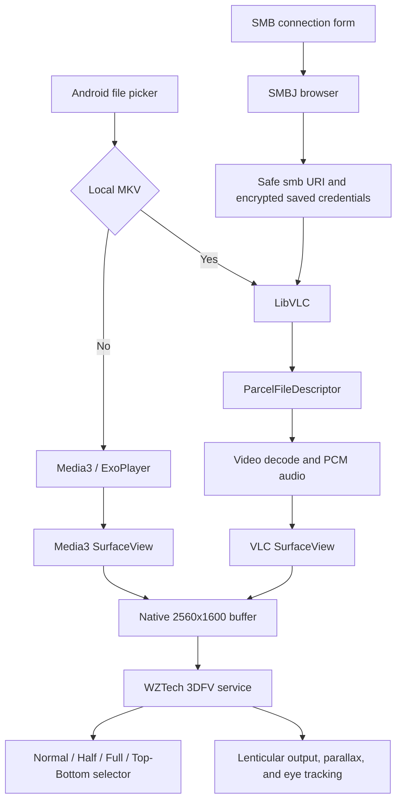

<div align="center">
  
  <h1>SKYY MKV 3D</h1>
  <p>An MKV, stereoscopic video, and SMB network player for the IQH3D SKYY tablet.</p>
</div>

## Overview

SKYY MKV 3D is an Android player built specifically for the IQH3D SKYY autostereoscopic tablet. It renders video through a real `SurfaceView`, preserves the tablet's native landscape buffer, and delegates lenticular processing, parallax adjustment, and eye tracking to the original WZTech 3DFV service included in the firmware.

The application does not recreate lenticular interlacing, replace `com.wztech.service3d`, clear its data, or use its legacy HTTP updater.

The current version is `1.1.4` (`versionCode 26`).

## Features

- MKV playback through LibVLC with decoded PCM audio output.
- Media3/ExoPlayer playback for supported non-MKV local files.
- A real fallback for AC3, E-AC3, DTS, and other MKV audio tracks unsupported by the firmware decoder.
- SMB2/SMB3 browsing and network playback from shared folders.
- Authenticated and anonymous SMB connections.
- Fullscreen landscape playback through a real `SurfaceView`.
- A native `2560x1600` SurfaceView buffer on the physical tablet.
- Integration with the floating 3DFV selector supplied by the SKYY firmware.
- Native 3DFV modes: Normal, Half SBS, Full SBS, and Top/Bottom.
- Native 3DFV parallax adjustment and eye tracking.
- Full-SBS normalization to prevent a small, narrow, or double-scaled image.
- Timeline, elapsed time, duration, pause, play, and 10-second seek controls.
- Runtime audio-track selection for multilingual and multichannel videos.
- Automatic playback-position memory for local and SMB videos.
- Controls inspired by the ergonomics of MX Player Pro, using only original code and assets.
- ARM32 output for `armeabi-v7a`.

## Validated Device

| Property | Observed value |
| --- | --- |
| Device | IQH3D SKYY |
| Android | 8.0 |
| Physical resolution reported by Android | `1600x2560` |
| Landscape playback resolution | `2560x1600` |
| 3D service package | `com.wztech.service3d` |
| 3DFV version | `3.5.201812182` |
| Target ABI | `armeabi-v7a` |
| Application package | `com.iqh3d.geoexplorer` |
| Player Activity | `com.iqh3d.geoexplorer.MainActivity` |

## Architecture



### Main Components

| Component | Responsibility |
| --- | --- |
| `MainActivity` | Activity lifecycle, local file picker, controls, playback engine selection, and native surface management. |
| `SmbBrowserDialog` | SMB connection form, SMB2/SMB3 directory browsing, video filtering, and credential lifecycle. |
| Media3 `1.4.1` | Playback engine for supported non-MKV local files. |
| LibVLC `3.6.5` | MKV playback, SMB streaming, video decoding, and PCM audio fallback. |
| SMBJ `0.13.0` | SMB2/SMB3 authentication and directory browsing. |
| `SurfaceView` | A real compositor surface visible to SurfaceFlinger and recognizable by 3DFV. |
| WZTech 3DFV | Native mode selector, stereoscopic transformation, parallax, lenticular output, and eye tracking. |

## Why Two Playback Engines Are Used

Media3 provides a clean Android playback path, but the SKYY firmware cannot decode every audio format commonly found in MKV files. During physical testing, some AC3 and E-AC3 files produced video without audio.
The reliable local MKV path is:

1. Open the selected `content://` URI with `ContentResolver.openFileDescriptor()`.
2. Keep the `ParcelFileDescriptor` alive for the complete playback session.
3. Construct LibVLC `Media` from the native file descriptor.
4. Disable encoded passthrough with `:no-audio-passthrough`.
5. Disable digital output and send decoded PCM to Android `AudioTrack`.

All local MKV files are sent directly to LibVLC so their audio behavior is predictable. Supported non-MKV files start in Media3.

## Native 3DFV Integration

> **Per-tablet setup is required.** The 3DFV whitelist is firmware data stored on each physical tablet, not inside the APK. Sharing or installing the APK does not transfer this entry to another device.

The repository includes a safe ADB helper that detects the installed Activity and active whitelist, prints the proposed entry and exact backup path, and asks for confirmation before changing anything:

```bash
./scripts/setup-3dfv-selector.sh --inspect-only
./scripts/setup-3dfv-selector.sh --apk /path/to/SKYY-MKV-3D-v1.1.4-arm32.apk
```

If the APK is already installed, omit `--apk`:

```bash
./scripts/setup-3dfv-selector.sh
```

The helper only backs up and updates the selected whitelist, restarts `com.wztech.service3d/.Service3D`, and relaunches the player. It never uninstalls, replaces, updates, or clears data from `com.wztech.service3d`.

If both whitelist variants exist and neither can be identified safely, the helper stops without changing them. Inspect the directory and rerun it with the confirmed path, for example the hidden path used by the tablet validated for this project:

```bash
./scripts/setup-3dfv-selector.sh --config /sdcard/K3DX/config/.white_list2.config
```

### Detected Activity

```text
com.iqh3d.geoexplorer.MainActivity
```

### Proposed and Installed Whitelist Entry

```text
30@com.iqh3d.geoexplorer.MainActivity
```

The `30@` prefix matches the entry type used by Chrome in this firmware. This entry type allows the native selector to appear instead of forcing one stereoscopic source mode.

### Active Configuration Path

Some SKYY firmware variants use this documented path:

```text
/sdcard/K3DX/config/white_list2.config
```

The physical tablet tested for this project uses the hidden file below as its active configuration:

```text
/sdcard/K3DX/config/.white_list2.config
```

Always inspect the directory and confirm the active file before modifying either path:

```bash
adb shell ls -la /sdcard/K3DX/config/
```

### Mandatory Backup

Back up the active file before making any change:

```bash
STAMP=$(date +%Y%m%d-%H%M%S)
SOURCE="/sdcard/K3DX/config/.white_list2.config"
BACKUP="/sdcard/K3DX/config/.white_list2.config.bak.$STAMP"
adb shell cp "$SOURCE" "$BACKUP"
adb shell ls -l "$BACKUP"
```

If inspection shows that the non-hidden file is active, use these exact paths instead:

```bash
STAMP=$(date +%Y%m%d-%H%M%S)
SOURCE="/sdcard/K3DX/config/white_list2.config"
BACKUP="/sdcard/K3DX/config/white_list2.config.bak.$STAMP"
adb shell cp "$SOURCE" "$BACKUP"
adb shell ls -l "$BACKUP"
```

### Register the Activity

Append the entry only if it is not already present:

```bash
ENTRY='30@com.iqh3d.geoexplorer.MainActivity'
SOURCE='/sdcard/K3DX/config/.white_list2.config'
adb shell "grep -qx '$ENTRY' '$SOURCE' || printf '%s\r\n' '$ENTRY' >> '$SOURCE'"
adb shell tail -10 "$SOURCE"
```

Reload the service so it reads the updated whitelist:

```bash
adb shell am stopservice -n com.wztech.service3d/.Service3D
adb shell am startservice -a com.wztech.service -p com.wztech.service3d
```

This procedure only stops and starts the service. It does not uninstall the package, replace its APK, or erase its data.

### Why Fixed SourceType Registration Is Avoided

The dynamic 3DFV protocol accepts a positive `SourceType`. On this tablet, sending a fixed source type can activate a mode immediately and hide the native Normal/Half/Full/Top-Bottom selector.

The player intentionally avoids automatic fixed-SourceType registration. The Activity is recognized through the whitelist, and the user chooses the packing mode through the original 3DFV panel.

## SurfaceView and Native Resolution

3DFV needs a real compositor surface. A `TextureView` or ordinary Android view can display a picture, but it does not expose the same firmware integration behavior.

The player uses:

- A Media3 `PlayerView` configured to produce a `SurfaceView`.
- A second real `SurfaceView` dedicated to LibVLC.
- Only one visible playback surface at a time.
- LibVLC `setWindowSize()` synchronization with the current physical surface.
- `VLCVout` reattachment when Android destroys and recreates the VLC surface.

The player does not request a 5120-pixel-wide buffer. That causes double scaling on this firmware and can produce a narrow picture. The required native landscape buffer is:

```text
2560x1600
```

Verify it with:

```bash
adb logcat -c
adb shell am start -n com.iqh3d.geoexplorer/.MainActivity
adb logcat | grep -E 'SurfaceView created|SurfaceView buffer/layout'
```

Expected output:

```text
SurfaceView buffer/layout: 2560x1600
```

Android can temporarily report `2560x1507` while the navigation bar or a system overlay is visible. Closing the overlay and restoring immersive fullscreen returns the surface to `2560x1600`.

## Full-SBS Normalization

A `3840x1080` Full-SBS frame contains two complete `1920x1080` views. If the player fits the packed frame into the display before 3DFV processes it, the final image becomes small or horizontally compressed.

For local files, the player reads the encoded dimensions with `MediaMetadataRetriever` and normalizes the transport aspect before playback:

```text
If width / height > 2.75:
    aspectWidth  = width
    aspectHeight = height * 2
```

Examples:

| Input | Aspect sent to LibVLC |
| --- | --- |
| `3840x1080` Full-SBS | `16:9` |
| `3840x800` Full-SBS | `12:5` |

A `3840x800` source is 2.40:1 per eye. Correct normalization removes the extremely narrow raw `4.8:1` packed strip. Small top and bottom bars remain on the tablet's 16:10 panel when the original cinema aspect is preserved; removing those bars would require cropping or stretching the picture.

For Full Top/Bottom files identified by their filename, the inverse transport correction is applied:

```text
aspectWidth  = width * 2
aspectHeight = height
```

LibVLC's decoded video layout callback and active video track also supply dimensions during playback. The active-track fallback is especially important for SMB streams, where Android's local metadata retriever cannot inspect the remote file directly and some firmware builds omit the expected layout callback.

After normalization, the native 3DFV mode performs the corresponding stereoscopic expansion and lenticular processing.

## SMB2/SMB3 Network Playback

Tap `SMB` in the top bar to connect to a network share. The connection form contains:

- `Server or IP (optional :port)`: a DNS name or IPv4 address, without a required `smb://` prefix. Port 445 is used when no port is specified.
- `Shared folder`: the SMB share name, not a local filesystem path.
- `Starting path (optional)`: a folder inside the share.
- `Username`: the SMB account name.
- `Password`: used only for the active connection and playback session.
- `Domain / workgroup`: commonly `WORKGROUP` on home networks.
- `Anonymous access`: use only when the server explicitly allows anonymous access.

The browser shows folders and supported video files. Selecting a file sends a safe `smb://host/share/path` URI to LibVLC and supplies authentication as LibVLC media options. A three-second network cache is enabled to reduce short Wi-Fi interruptions.

### Supported Network Video Extensions

```text
.mkv .mp4 .webm .avi .mov .m2ts .ts
```

### Credential Handling

- The host, share, starting path, username, domain, and anonymous setting are saved for convenience.
- The password is encrypted with AES-GCM before its ciphertext and random IV are written to private `SharedPreferences`.
- The encryption key is non-exportable and remains in Android Keystore on the tablet.
- The password is restored automatically for the saved SMB connection.
- Application-data backup is disabled so encrypted credentials cannot be restored without their Keystore key.
- Decrypted password characters are held in memory only while editing, browsing, or playing the selected remote file.
- Password buffers are cleared when another file is selected, when the dialog closes, or when the Activity is destroyed.
- The visible URI never embeds `username:password@host`.

SMBJ directory browsing caps anonymous sessions at SMB2.1 because anonymous SMB3 sessions do not provide the session key required for SMB3 key derivation. Authenticated browsing retains SMB3 negotiation, and LibVLC independently negotiates the protocol used for media playback.

### Server Requirements

- Enable SMB2 or SMB3 on the NAS, Windows PC, macOS host, or Samba server.
- Permit TCP port 445 between the tablet and server.
- Place both devices on networks that can route to each other.
- Grant the configured account read access to the share and files.
- SMB1-only servers are not supported and should not be enabled for this application.

### Example Connections

| Server type | Server or IP | Shared folder | Domain/workgroup |
| --- | --- | --- | --- |
| Windows | `192.168.1.20` | `Videos` | Windows domain or `WORKGROUP` |
| Samba/NAS | `nas.local` | `media` | Usually `WORKGROUP` |
| macOS File Sharing | Mac IP address | Published share name | Account-specific |
| Nonstandard port | `192.168.1.30:1445` | `media` | Server-specific |

The application does not perform automatic server or share discovery in version `1.1.4`; enter the server and share explicitly.

## Playback Resume

The player remembers progress independently for each local or SMB video. Media identities are stored as SHA-256 hashes, so the playback-position database does not expose local content URIs, SMB paths, or credentials.

- Progress is saved every 10 seconds while playing.
- Progress is also saved when pausing, leaving the Activity, or changing files.
- Reopening the same video displays a non-dismissible choice to `RESUME` from the restored timestamp or `START OVER` from `00:00`.
- Choosing `START OVER` removes the old saved position for that video.
- Positions below 5 seconds are ignored.
- Positions within 15 seconds of the end are removed so completed videos restart from the beginning.
- SMB resume uses the safe media URI only; passwords remain in the separate Keystore-backed credential store.

## Player Interface

The interface is entirely in English and follows a tablet-oriented media player layout:

- File name and active playback engine in the header.
- `OPEN`, `SMB`, `AUDIO`, and `3D` actions.
- An `AUDIO` selector showing the active track plus available language, channel layout, and codec metadata.
- Cyan playback timeline.
- Elapsed time on the left and duration on the right.
- `-10`, `PLAY/PAUSE`, and `+10` controls.
- `FILE` and `FIT` actions.
- Automatic control hiding after five seconds.
- Tap on the video to restore the controls.

The icon, logo, and implementation are original to this project. The layout references common media-player ergonomics observed in MX Player Pro but contains no extracted MX Player code, images, or resources.

## Project Structure

```text
.
|-- app/
|   |-- build.gradle
|   `-- src/main/
|       |-- AndroidManifest.xml
|       |-- java/com/iqh3d/geoexplorer/
|       |   |-- MainActivity.java
|       |   `-- SmbBrowserDialog.java
|       `-- res/
|           |-- drawable/ic_skyy_logo.xml
|           `-- values/styles.xml
|-- docs/skyy-logo.svg
|-- build.gradle
|-- settings.gradle
|-- gradle.properties
|-- gradle/wrapper/
|-- gradlew
`-- gradlew.bat
```

## Build Requirements

- JDK 17.
- Android SDK with `compileSdk 35`.
- ADB for installation and physical testing.
- Included Gradle Wrapper `8.9`.
- Android Gradle Plugin `8.7.3`.

Clone the repository:

```bash
git clone git@github.com:jdmarinv/SKYY-MKV-3D.git
cd SKYY-MKV-3D
```

Android configuration:

| Setting | Value |
| --- | --- |
| `applicationId` | `com.iqh3d.geoexplorer` |
| `minSdk` | `26` |
| `targetSdk` | `28` |
| `compileSdk` | `35` |
| ABI | `armeabi-v7a` |

`targetSdk 28` is intentional for compatibility with the tablet's Android 8 firmware. The local release build disables the `ExpiredTargetSdkVersion` warning. This does not mean the APK meets current Google Play publication requirements.

## Build

Development build:

```bash
./gradlew :app:assembleDebug
```

Release build:

```bash
./gradlew :app:assembleRelease
```

Outputs:

```text
app/build/outputs/apk/debug/app-debug.apk
app/build/outputs/apk/release/app-release.apk
```

On macOS with Homebrew JDK 17:

```bash
export JAVA_HOME=/opt/homebrew/opt/openjdk@17/libexec/openjdk.jdk/Contents/Home
export PATH="$JAVA_HOME/bin:$PATH"
./gradlew :app:assembleRelease
```

## APK Signing

The current `release` build is signed with the local debug key so development builds can update the installed application without uninstalling it or losing state.

Before commercial distribution, create a private release keystore, store it outside the repository, and configure Gradle through environment variables or an untracked local file. Never commit a private signing key.

The validated `1.1.4` APK uses APK Signature Scheme v2.

## Install and Launch

For a new tablet, use the provisioning helper so installation and native 3DFV registration happen together:

```bash
./scripts/setup-3dfv-selector.sh --apk app/build/outputs/apk/release/app-release.apk
```

This is a one-time step for every physical tablet. A normal reinstall with `adb install -r` preserves the entry once that tablet has been provisioned.

To install without configuring 3DFV:

```bash
adb devices
adb install -r app/build/outputs/apk/release/app-release.apk
adb shell am force-stop com.iqh3d.geoexplorer
adb shell am start -n com.iqh3d.geoexplorer/.MainActivity
```

Verify the installed version:

```bash
adb shell dumpsys package com.iqh3d.geoexplorer | grep -E 'versionCode|versionName'
```

Expected result:

```text
versionCode=26
versionName=1.1.4
```

## Validate the ARM32 ABI

```bash
unzip -l app/build/outputs/apk/release/app-release.apk | grep 'lib/[^/]*/libvlc.so'
```

Expected result:

```text
lib/armeabi-v7a/libvlc.so
```

## Physical Test Plan

| Test | Expected result |
| --- | --- |
| 2D MKV + Normal | Full 2D image with audible audio. |
| Half-SBS + Half SBS | Correct stereoscopic fusion without a narrow image. |
| Full-SBS `3840x1080` + Full SBS | Each eye retains `16:9`; playback fills the display. |
| Full-SBS `3840x800` + Full SBS | Transport is normalized to `12:5`. |
| Top/Bottom + Top/Bottom | Correct vertical stereoscopic fusion. |
| MKV with AC3/E-AC3 | LibVLC is active and decoded PCM is audible. |
| Multilingual MKV | `AUDIO` lists the tracks and changes language without restarting playback. |
| Local playback resume | Reopening the same local video offers `RESUME` and `START OVER`. |
| SMB playback resume | Reopening the same SMB video offers `RESUME` and `START OVER` before opening the stream. |
| Playback timeline | Time advances and dragging the timeline changes position. |
| `-10` and `+10` | Seek remains between zero and total duration. |
| Automatic hiding | Controls disappear after five seconds. |
| Tap video | Controls return. |
| Change local file | Previous descriptor is released and the 3DFV panel remains available. |
| Change SMB file | Previous credentials are cleared and the new stream starts. |
| Authenticated SMB MKV | Browser lists the share; video and audio stream through LibVLC. |
| Anonymous SMB MKV | Connection works only when the server permits anonymous access. |
| Enter/exit fullscreen | Surface returns to `2560x1600`. |
| Exit or pause | Playback pauses and no audio remains active in another application. |
| 3DFV panel | Native selector shows Normal, Half SBS, Full SBS, Top/Bottom, and parallax. |
| Eye tracking | Lenticular fusion follows the viewer on the physical display. |

Left/right eye swapping is not implemented inside the player in version `1.1.4`. If a file is reversed, correct it at the source or use a firmware mode that provides eye-order control, if available.

Lenticular fusion and eye tracking must be confirmed by looking at the physical screen. An ADB screenshot contains the packed source frame and cannot prove the final optical effect.

### SMB Validation Record

The `1.1.0` release was tested on the physical SKYY tablet against Samba `4.24.5` through an ADB TCP tunnel to isolate the application from local Wi-Fi routing differences.

The validated sequence was:

1. Connect anonymously to an SMB2 share at a nonstandard test port.
2. Browse the share and list the remote `skyy-eac3-full-sbs-test.mkv` file.
3. Select the 92 MB remote MKV without downloading it through the Android file picker.
4. Stream the file directly through LibVLC.
5. Decode the `3840x800` Full-SBS video, read its active LibVLC track dimensions, and normalize the raw packed frame to `12:5` on the real VLC `SurfaceView`.
6. Confirm that the playback timeline advances.
7. Confirm a started Android PCM `AudioTrack` for the E-AC3 audio.
8. Confirm that the native 3DFV edge control remains present while the player is active.

The ADB tunnel and temporary Samba share were used only for validation and are not required by the application. On a normal LAN, enter the NAS or computer address directly.

## Troubleshooting

### Audio Works but Video Is Black

1. Confirm that the VLC `SurfaceView` was created.
2. Confirm that `VLCVout` reattaches after `surfaceCreated()`.
3. Confirm that only one playback SurfaceView is visible.

```bash
adb logcat | grep -E 'VLC SurfaceView|VLCVout|SkyyMkvPlayer'
```

### Video Works but MKV Audio Is Silent

1. Confirm that the MKV entered the LibVLC path.
2. Look for `VLC active, PCM audio` in logcat.
3. Confirm that passthrough and digital output are disabled.
4. Confirm that the local file descriptor remains open.

```bash
adb logcat | grep -E 'AudioTrack|AudioFlinger|VLC active|PCM'
```

### Full-SBS Appears Small

Inspect dimension detection and normalized aspect logs:

```bash
adb logcat | grep -E 'Dimensions detected|Full-SBS normalized'
```

For `3840x1080`, the normalized aspect must be `16:9`.

### SMB Connection Fails

1. Verify that the host and share name are separate and correct.
2. Verify that the tablet can route to the server IP.
3. Verify TCP port 445 and SMB2/SMB3 are enabled.
4. Verify account permissions and the domain/workgroup.
5. Disable `Anonymous access` unless the server explicitly supports it.
6. Check Android and LibVLC logs without exposing the password.

```bash
adb logcat | grep -E 'SMB|smb|VLC|SkyyMkvPlayer'
```

### SMB Browser Works but Playback Fails

Directory browsing uses SMBJ, while playback uses LibVLC. If listing succeeds but playback fails:

1. Confirm that the selected file extension is supported.
2. Confirm that the account has read permission for the file, not only list permission for the folder.
3. Test a smaller MKV to separate network throughput from authentication issues.
4. Check that the server is not requiring SMB signing or encryption unsupported by the tablet's LibVLC build.

### Native 3DFV Panel Does Not Appear

The most common cause on a second tablet is that the APK was installed but its device-local whitelist was never provisioned. Diagnose it first:

```bash
./scripts/setup-3dfv-selector.sh --inspect-only
```

1. Confirm that the full Activity name exists in the active whitelist.
2. Confirm that the entry uses the same `30@` type as Chrome.
3. Confirm that no dynamic fixed `SourceType` registration is active.
4. Reload the service without deleting its data.
5. Launch the Activity again.

```bash
adb shell grep 'com.iqh3d.geoexplorer.MainActivity' /sdcard/K3DX/config/.white_list2.config
adb shell dumpsys window windows | grep com.wztech.service3d
```

### Surface Reports `2560x1507`

The navigation bar or a system overlay currently owns part of the display. Close the expanded overlay, return to the Activity, and restore immersive mode. Do not compensate by creating a 5120-pixel buffer.

### Selector Appears but 3D Does Not Fuse

The overlay confirms Activity recognition, not optical calibration. Verify:

- The selected 3DFV mode matches the file packing.
- The viewer's head is inside the tracking area.
- Eye tracking is enabled in the firmware.
- Left/right eye order is correct in the source.
- Parallax begins near zero and is adjusted conservatively.

## Security and Operational Rules

- Do not uninstall `com.wztech.service3d`.
- Do not clear its application data.
- Do not replace its APK.
- Do not use the legacy 3DFV HTTP updater.
- Always back up the active whitelist before editing it.
- Do not register a fixed 3D mode when the native selector is required.
- Do not publish firmware APKs or copyrighted test media.
- Do not include SMB passwords in URIs, logs, screenshots, or commits.
- Do not enable SMB1 to make an old server compatible.
- Do not claim optical 3D success based only on a service response or ADB screenshot.

## Known Limitations

- Left/right eye swapping is not implemented inside the player in `1.1.4`.
- Full Top/Bottom detection currently depends partly on filename patterns.
- SMB server/share discovery is not implemented; users enter both values explicitly.
- Remote metadata is available only after LibVLC begins decoding the stream.
- The 3DFV panel belongs to the firmware and may temporarily reveal the Android navigation bar.
- The deliverable APK uses a debug v2 signature; public distribution needs a private release keystore.
- The project targets this Android 8 tablet and is not prepared for general Google Play distribution.

## Development History

1. Identified the player package and full Activity name.
2. Inspected `com.wztech.service3d` and located the active whitelist.
3. Backed up the whitelist and registered the Activity with the Chrome-compatible `30@` prefix.
4. Removed fixed dynamic mode registration that hid the native selector.
5. Replaced non-recognized rendering with a real `SurfaceView`.
6. Diagnosed silent MKV audio and added LibVLC PCM output.
7. Corrected `content://` playback by using a persistent `ParcelFileDescriptor`.
8. Fixed black video after Android recreated the VLC SurfaceView.
9. Normalized Full-SBS transport to prevent small or double-compressed output.
10. Added the timeline, seeking, time labels, and automatic control hiding.
11. Studied MX Player Pro ergonomics and redesigned the player controls in English.
12. Created original SKYY MKV 3D branding and an ARM32 APK.
13. Added SMBJ-based SMB2/SMB3 browsing and LibVLC network playback.
14. Added in-memory-only SMB password handling and lifecycle cleanup.
15. Updated the application to `1.1.0` (`versionCode 22`).
16. Added runtime audio-track selection and updated the application to `1.1.1` (`versionCode 23`).
17. Added Android Keystore-backed SMB password persistence and updated the application to `1.1.2` (`versionCode 24`).
18. Added automatic local and SMB playback resume and updated the application to `1.1.3` (`versionCode 25`).
19. Added a resume-or-start-over prompt and updated the application to `1.1.4` (`versionCode 26`).

## Upstream Projects

- [AndroidX Media3](https://github.com/androidx/media)
- [VLC for Android and LibVLC](https://github.com/videolan/vlc-android)
- [SMBJ](https://github.com/hierynomus/smbj)

## License and Third-Party Notices

Review the licenses of Media3, LibVLC, SMBJ, and their transitive dependencies before distributing the APK. This repository does not include proprietary SKYY firmware packages, the WZTech 3DFV APK, MX Player assets, or copyrighted sample movies.
