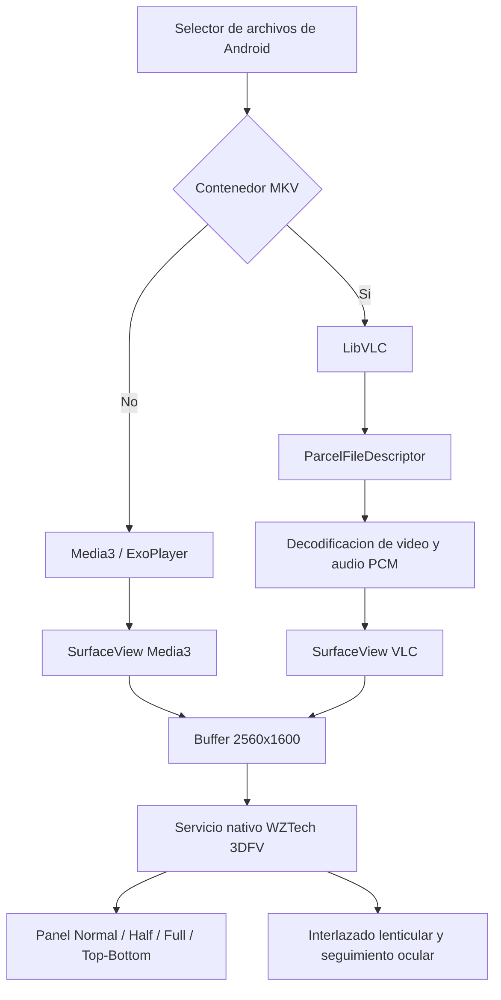

<div align="center">
  
  <h1>SKYY MKV 3D</h1>
  <p>Reproductor Android de MKV y video estereoscopico para la tablet IQH3D SKYY.</p>
</div>

## Descripcion

SKYY MKV 3D es un reproductor Android disenado especificamente para la tablet autostereoscopica IQH3D SKYY. Reproduce video sobre un `SurfaceView` real, conserva el buffer nativo de la pantalla y delega el procesamiento lenticular y el seguimiento ocular al servicio original WZTech 3DFV incluido en el firmware.

El proyecto no recrea el interlazado lenticular, no reemplaza `com.wztech.service3d` y no utiliza el actualizador HTTP heredado del servicio.

La version documentada es `1.0.0` (`versionCode 21`). La interfaz del reproductor esta en ingles.

## Resultado

- Reproduccion MKV mediante LibVLC con salida de audio PCM.
- Reproduccion de otros contenedores mediante AndroidX Media3/ExoPlayer.
- Fallback real para AC3, E-AC3 y otros audios MKV que Media3 o el firmware no reproducen.
- `SurfaceView` de pantalla completa en landscape.
- Buffer validado de `2560x1600` en la tablet fisica.
- Integracion con el selector flotante nativo de 3DFV.
- Modos nativos disponibles: Normal, Half SBS, Full SBS y Top/Bottom.
- Ajuste de paralaje proporcionado por 3DFV.
- Normalizacion de Full-SBS para evitar imagen pequena, angosta o escalada dos veces.
- Barra de progreso, tiempo actual, duracion, pausa, avance y retroceso de 10 segundos.
- Controles inspirados en la ergonomia de MX Player Pro, sin reutilizar codigo ni recursos de MX Player.
- APK ARM32 para `armeabi-v7a`.

## Hardware y firmware validados

| Propiedad | Valor observado |
| --- | --- |
| Dispositivo | IQH3D SKYY |
| Android | 8.0 |
| Resolucion fisica reportada | `1600x2560` |
| Resolucion landscape usada | `2560x1600` |
| Servicio 3D | `com.wztech.service3d` |
| Version 3DFV | `3.5.201812182` |
| ABI objetivo | `armeabi-v7a` |
| Activity del reproductor | `com.iqh3d.geoexplorer.MainActivity` |

## Arquitectura



### Componentes principales

| Componente | Responsabilidad |
| --- | --- |
| `MainActivity` | Ciclo de vida, selector de archivos, controles y coordinacion de motores. |
| Media3 `1.4.1` | Reproduccion principal de formatos no MKV. |
| LibVLC `3.6.5` | Reproduccion MKV y fallback de audio PCM. |
| `SurfaceView` | Superficie real reconocible por SurfaceFlinger y 3DFV. |
| 3DFV | Selector nativo, transformacion 3D, paralaje y seguimiento ocular. |

## Por que se usan dos motores

Media3 ofrece una integracion Android limpia, pero en este firmware algunos MKV con AC3 o E-AC3 producian video sin audio. MX Player Pro instalado en la tablet tambien informo que E-AC3 no estaba soportado.

El fallback inicial no fue suficiente porque abrir directamente una URI `content://` desde LibVLC fallo en el dispositivo. La solucion estable fue:

1. Abrir la URI seleccionada con `ContentResolver.openFileDescriptor()`.
2. Mantener vivo el `ParcelFileDescriptor` durante la reproduccion.
3. Crear el objeto `Media` de LibVLC desde el descriptor nativo.
4. Desactivar passthrough con `:no-audio-passthrough`.
5. Desactivar salida digital y entregar PCM al `AudioTrack` de Android.

Todos los MKV se envian actualmente a LibVLC para que el comportamiento de audio sea predecible. Los demas contenedores comienzan en Media3.

## Integracion con 3DFV

### Activity registrada

```text
com.iqh3d.geoexplorer.MainActivity
```

### Entrada de whitelist

```text
30@com.iqh3d.geoexplorer.MainActivity
```

El prefijo `30@` replica el tipo de entrada utilizado por Chrome en el firmware. Este tipo permite que aparezca el selector nativo en lugar de forzar un modo estereoscopico fijo.

### Ruta real de configuracion

Aunque algunas variantes del firmware documentan `white_list2.config`, en la tablet validada el archivo activo es oculto:

```text
/sdcard/K3DX/config/.white_list2.config
```

### Respaldo obligatorio

Antes de modificar la whitelist:

```bash
STAMP=$(date +%Y%m%d-%H%M%S)
BACKUP="/sdcard/K3DX/config/.white_list2.config.bak.$STAMP"
adb shell cp /sdcard/K3DX/config/.white_list2.config "$BACKUP"
adb shell ls -l "$BACKUP"
```

Agregar la Activity una sola vez:

```bash
ENTRY='30@com.iqh3d.geoexplorer.MainActivity'
adb shell "grep -qx '$ENTRY' /sdcard/K3DX/config/.white_list2.config || printf '%s\r\n' '$ENTRY' >> /sdcard/K3DX/config/.white_list2.config"
adb shell tail -10 /sdcard/K3DX/config/.white_list2.config
```

Recargar el servicio para que vuelva a leer la whitelist:

```bash
adb shell am stopservice -n com.wztech.service3d/.Service3D
adb shell am startservice -a com.wztech.service -p com.wztech.service3d
```

Este procedimiento detiene e inicia el servicio. No desinstala el paquete, no borra datos y no reemplaza su APK.

### Por que no se registra un SourceType fijo

El protocolo dinamico de 3DFV permite enviar un `SourceType` positivo. En esta tablet eso activa directamente un modo y puede ocultar el selector Normal/Half/Full/Top-Bottom. El reproductor no realiza ese registro automatico porque el objetivo es conservar el panel flotante nativo.

La Activity se reconoce mediante whitelist y el usuario elige el modo en 3DFV.

## Superficie y resolucion

3DFV necesita una superficie componible real. Un `TextureView` o una vista Android convencional puede reproducir imagen, pero no ofrece el mismo comportamiento al middleware del firmware.

El proyecto usa:

- `PlayerView` de Media3 configurado para producir `SurfaceView`.
- Un segundo `SurfaceView` dedicado a LibVLC.
- Una sola superficie visible a la vez.
- `setWindowSize()` para sincronizar LibVLC con el tamano real.
- Reconexion de `VLCVout` cuando Android destruye y recrea la superficie.

No se configura un buffer de `5120` pixeles. En SKYY ese enfoque puede provocar escalado doble y producir una imagen estrecha. El buffer esperado es siempre:

```text
2560x1600
```

Verificacion por logs:

```bash
adb logcat -c
adb shell am start -n com.iqh3d.geoexplorer/.MainActivity
adb logcat | grep -E 'SurfaceView created|SurfaceView buffer/layout'
```

Salida esperada:

```text
SurfaceView buffer/layout: 2560x1600
```

Al abrir paneles del sistema o perder modo inmersivo puede aparecer temporalmente `2560x1507`. Al cerrar la superposicion y recuperar fullscreen la superficie vuelve a `2560x1600`.

## Correccion de Full-SBS

Un Full-SBS de `3840x1080` contiene dos vistas completas de `1920x1080`. Si el reproductor ajusta el frame empacado completo dentro de la pantalla antes de que 3DFV lo procese, la imagen queda pequena o comprimida.

El reproductor inspecciona dimensiones con `MediaMetadataRetriever` y normaliza el aspecto de transporte antes de reproducir:

```text
Si width / height > 2.75:
    aspectWidth  = width
    aspectHeight = height * 2
```

Ejemplos:

| Entrada | Aspecto enviado a VLC |
| --- | --- |
| `3840x1080` Full-SBS | `16:9` |
| `3840x800` Full-SBS | `12:5` |

Para archivos Full Top/Bottom identificados por nombre se aplica la transformacion inversa:

```text
aspectWidth  = width * 2
aspectHeight = height
```

El panel 3DFV realiza despues la expansion y el procesamiento correspondientes al modo seleccionado.

## Interfaz

La interfaz esta escrita en ingles y sigue una estructura familiar para reproductores de tablet:

- Nombre del archivo y estado del motor en la cabecera.
- Acciones `OPEN`, `AUDIO` y `3D`.
- Barra de progreso cian.
- Tiempo actual a la izquierda y duracion a la derecha.
- Controles `-10`, `PLAY/PAUSE` y `+10`.
- Acciones `FILE` y `FIT`.
- Ocultamiento automatico despues de cinco segundos.
- Toque sobre el video para recuperar los controles.

El icono y la marca son originales de este proyecto. Los controles toman como referencia patrones comunes observados en MX Player Pro, pero no incluyen codigo, imagenes ni recursos extraidos de esa aplicacion.

## Estructura del proyecto

```text
.
|-- app/
|   |-- build.gradle
|   `-- src/main/
|       |-- AndroidManifest.xml
|       |-- java/com/iqh3d/geoexplorer/MainActivity.java
|       `-- res/
|           |-- drawable/ic_skyy_logo.xml
|           `-- values/styles.xml
|-- docs/skyy-logo.svg
|-- build.gradle
|-- settings.gradle
|-- gradle.properties
|-- gradle/wrapper/
|-- gradlew
`-- gradlew.bat
```

## Requisitos de compilacion

- JDK 17.
- Android SDK con `compileSdk 35`.
- ADB disponible para instalacion y pruebas.
- Gradle Wrapper incluido, version `8.9`.
- Android Gradle Plugin `8.7.3`.

Clonar el repositorio:

```bash
git clone git@github.com:jdmarinv/SKYY-MKV-3D.git
cd SKYY-MKV-3D
```

Configuracion Android:

| Opcion | Valor |
| --- | --- |
| `applicationId` | `com.iqh3d.geoexplorer` |
| `minSdk` | `26` |
| `targetSdk` | `28` |
| `compileSdk` | `35` |
| ABI | `armeabi-v7a` |

`targetSdk 28` se conserva deliberadamente por compatibilidad con el firmware Android 8 de la tablet. El warning `ExpiredTargetSdkVersion` se desactiva para el build release local. Esto no implica que el APK cumpla los requisitos actuales de publicacion de Google Play.

## Compilar

Build de desarrollo:

```bash
./gradlew :app:assembleDebug
```

Build release usado para la entrega:

```bash
./gradlew :app:assembleRelease
```

Salidas:

```text
app/build/outputs/apk/debug/app-debug.apk
app/build/outputs/apk/release/app-release.apk
```

En macOS con Homebrew JDK 17:

```bash
export JAVA_HOME=/opt/homebrew/opt/openjdk@17/libexec/openjdk.jdk/Contents/Home
export PATH="$JAVA_HOME/bin:$PATH"
./gradlew :app:assembleRelease
```

## Firma de APK

La configuracion actual firma el build `release` con la clave debug local para que pueda actualizar las iteraciones instaladas durante el desarrollo sin desinstalar ni perder estado.

Antes de distribuir comercialmente el reproductor se debe crear un keystore privado, guardarlo fuera del repositorio y configurar Gradle mediante variables de entorno o un archivo local no versionado. No se debe publicar una clave privada en Git.

La APK `1.0.0` validada usa APK Signature Scheme v2.

## Instalar y abrir

```bash
adb devices
adb install -r app/build/outputs/apk/release/app-release.apk
adb shell am force-stop com.iqh3d.geoexplorer
adb shell am start -n com.iqh3d.geoexplorer/.MainActivity
```

Verificar version instalada:

```bash
adb shell dumpsys package com.iqh3d.geoexplorer | grep -E 'versionCode|versionName'
```

Resultado esperado:

```text
versionCode=21
versionName=1.0.0
```

## Validar ABI

```bash
unzip -l app/build/outputs/apk/release/app-release.apk | grep 'lib/[^/]*/libvlc.so'
```

Resultado esperado:

```text
lib/armeabi-v7a/libvlc.so
```

## Plan de pruebas fisicas

| Prueba | Resultado esperado |
| --- | --- |
| MKV 2D + Normal | Imagen 2D completa y audio. |
| Half-SBS + Half | Fusion estereoscopica sin imagen angosta. |
| Full-SBS `3840x1080` + Full | Cada ojo conserva aspecto `16:9`; pantalla llena. |
| Full-SBS `3840x800` + Full | Transporte normalizado a `12:5`. |
| Top/Bottom + Top-Bottom | Fusion vertical correcta. |
| MKV AC3/E-AC3 | LibVLC activo y salida PCM audible. |
| Barra de progreso | Tiempo avanza y el seek cambia posicion. |
| `-10` y `+10` | Salto limitado entre cero y duracion total. |
| Auto-ocultado | Controles desaparecen despues de cinco segundos. |
| Toque sobre video | Controles reaparecen. |
| Cambio de archivo | Se libera descriptor anterior y se conserva el panel 3DFV. |
| Fullscreen | Surface vuelve a `2560x1600`. |
| Salida o pausa | Reproduccion se pausa y no queda audio activo. |

La fusion lenticular y el seguimiento ocular solo pueden confirmarse mirando la pantalla fisica. Una captura ADB muestra los frames empacados, pero no demuestra el efecto optico final.

## Diagnostico

### Hay audio pero no video

1. Confirmar que el `VLC SurfaceView` fue creado.
2. Revisar que `VLCVout` se vuelva a adjuntar despues de `surfaceCreated()`.
3. Confirmar que solo uno de los dos SurfaceView este visible.

```bash
adb logcat | grep -E 'VLC SurfaceView|VLCVout|SkyyMkvPlayer'
```

### Hay video pero no audio

1. Confirmar que el archivo MKV entro por LibVLC.
2. Buscar `VLC active, PCM audio` en logcat.
3. Confirmar que passthrough y salida digital estan desactivados.
4. Verificar que el descriptor del archivo siga abierto.

```bash
adb logcat | grep -E 'AudioTrack|AudioFlinger|VLC active|PCM'
```

### Full-SBS aparece pequeno

Buscar la deteccion de dimensiones y el aspecto normalizado:

```bash
adb logcat | grep -E 'Dimensions detected|Full-SBS normalized'
```

Para `3840x1080` debe aparecer `16:9`.

### No aparece el panel 3DFV

1. Confirmar que la Activity completa este en `.white_list2.config`.
2. Confirmar que no exista un registro dinamico con `SourceType` fijo.
3. Recargar el servicio sin borrar sus datos.
4. Abrir nuevamente la Activity.

```bash
adb shell grep 'com.iqh3d.geoexplorer.MainActivity' /sdcard/K3DX/config/.white_list2.config
adb shell dumpsys window windows | grep com.wztech.service3d
```

### La superficie reporta `2560x1507`

Eso ocurre cuando aparece la barra de navegacion o una superposicion toma foco. Cerrar el panel expandido, volver a la Activity y recuperar modo inmersivo. No compensar creando un buffer de `5120`.

### El selector aparece, pero el 3D no fusiona

El overlay confirma reconocimiento de la Activity, no confirma calibracion optica. Verificar:

- Modo correcto para el packing del archivo.
- Distancia y posicion de la cabeza.
- Seguimiento ocular activo en el firmware.
- Orden izquierda/derecha del contenido.
- Paralaje conservador cerca de cero.

## Seguridad y reglas operativas

- No desinstalar `com.wztech.service3d`.
- No borrar sus datos.
- No reemplazar su APK.
- No usar el actualizador HTTP heredado.
- Respaldar siempre la whitelist antes de modificarla.
- No publicar APKs del firmware ni contenido multimedia de prueba.
- No registrar un modo 3D fijo si se necesita el selector nativo.
- No afirmar que el 3D funciona solo por recibir una respuesta del servicio.

## Limitaciones conocidas

- El intercambio L/R no esta implementado dentro del reproductor `1.0.0`.
- La deteccion Full Top/Bottom depende actualmente de patrones en el nombre del archivo.
- El panel 3DFV pertenece al firmware y puede tomar foco o mostrar temporalmente la barra de navegacion.
- La APK de entrega usa firma debug v2; una distribucion publica necesita un keystore de release privado.
- El proyecto esta optimizado para esta tablet Android 8, no para publicacion general en Google Play.

## Historial resumido del desarrollo

1. Se identificaron el package y la Activity del reproductor.
2. Se inspecciono el servicio `com.wztech.service3d` y su whitelist activa.
3. Se respaldo la configuracion y se registro la Activity con prefijo `30@`.
4. Se elimino el registro dinamico fijo que ocultaba el selector nativo.
5. Se reemplazo el render no reconocido por un `SurfaceView` real.
6. Se diagnostico el audio MKV silencioso y se agrego LibVLC con PCM.
7. Se corrigio la apertura `content://` mediante `ParcelFileDescriptor`.
8. Se corrigio la perdida de video al recrearse el SurfaceView de VLC.
9. Se normalizo Full-SBS para evitar imagen pequena y compresion doble.
10. Se agregaron timeline, seek, tiempos y auto-ocultado.
11. Se estudio la ergonomia de MX Player Pro y se redisenaron los controles en ingles.
12. Se creo una marca original y se genero la APK ARM32 `1.0.0`.
